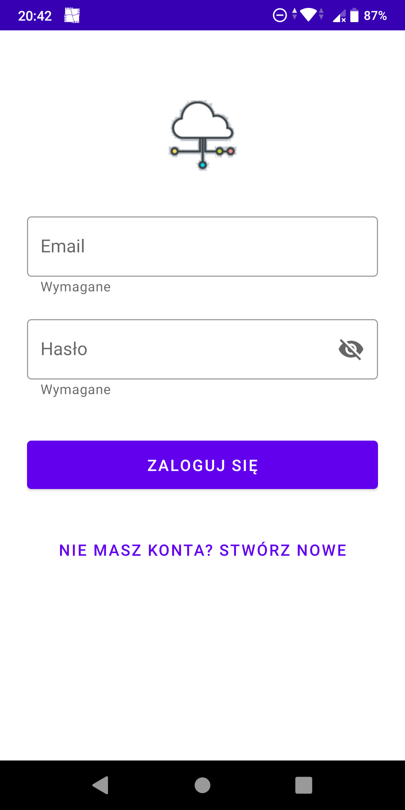
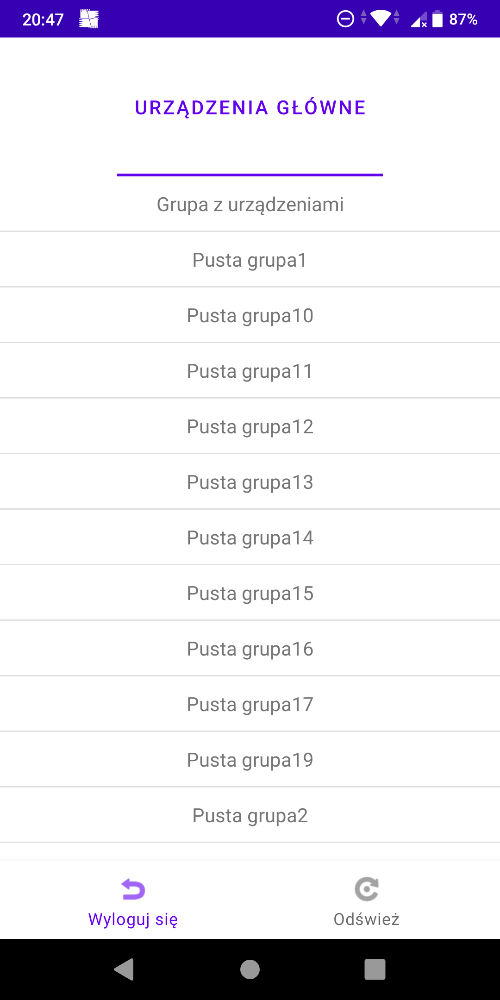
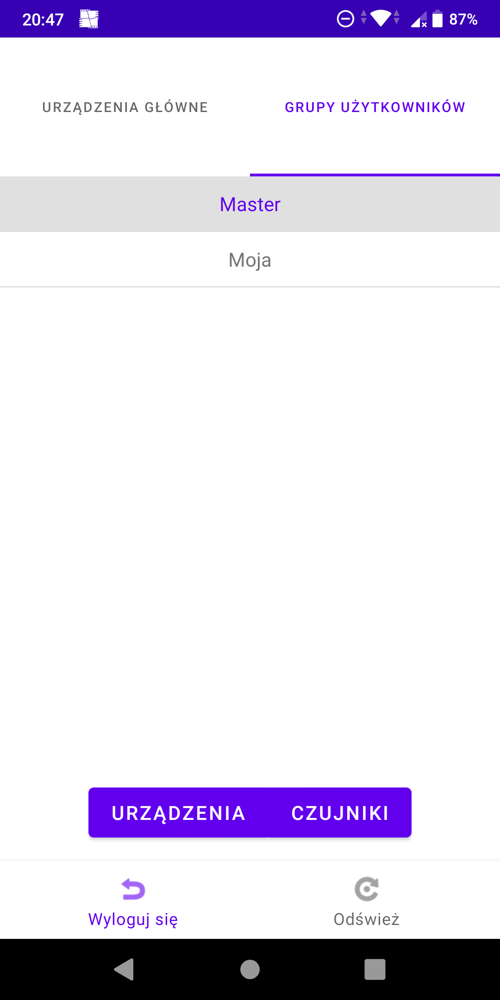
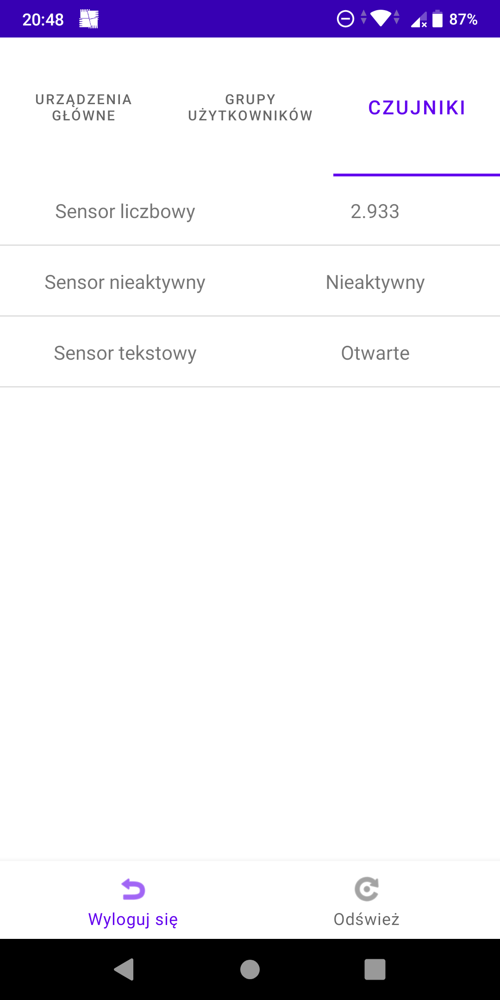
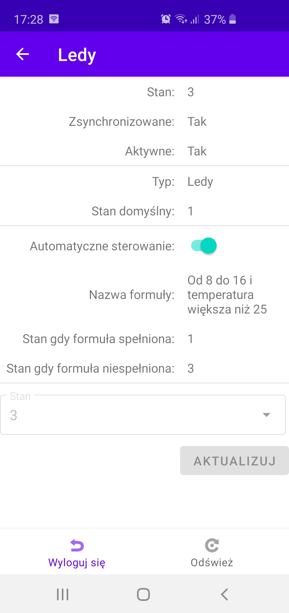

# IoT Mobile
### A mobile application for managing IoT devices.

The goal of this project is to create a mobile application for Android that allows users to manage their IoT devices.

This project is part of IoT System. Other components in the system:
- A web application - [IoT-front](https://github.com/michalkoziara/IoT-front)
- RESTful web service - [IoT-RESTful-Webservice](https://github.com/michalkoziara/IoT-RESTful-Webservice)

## Getting Started

These instructions will get you a copy of the project up and running on 
your local machine for development and testing purposes.

### Prerequisites

* Android SDK
* Android Studio - https://developer.android.com/studio/

Detailed information about installation and configurations are provided at developers' site.

## Technology Stack

* Android
* Java
* SQLite
* JWT

## Preview

<table>
    <tr>
        <td>
            
Sign In

            
        </td>
        <td>
            
Hubs

            
        </td>
        <td>
            
User Groups

            
        </td>
    </tr>
    <tr>
        <td>
            
Sensors

            
        </td>
        <td>
            
Device Management

            
        </td>
    </tr>
</table>

## Author
* **Michał Koziara**
